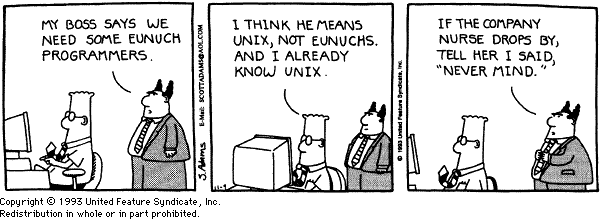
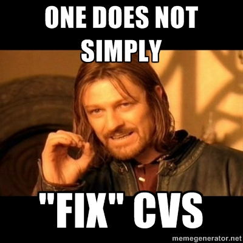

History
=======

.. notslides::
    How old do you think this problem of 'what version of the file am I talking about' it? Well email as we know it is based
    on the Simple Mail Transfer Protocol which as first documented in 1982. This was based on earlier protocols such as the
    Mail Box Protocol (c. 1971, disputed), Mail Protocol (c. 1973) and FTP Mail (c. 1973).

    So networked email first became available on networks around the early seventies. But people didn't use it. They had
    little need within an institution for the simple reason that in any one institution there was probably only one
    computer.

    Instead they used a 'time sharing' system in which multiple keyboards and, in modern parlance, monitors were connected
    to a single machine giving each user the illusion of being the sole user of the machine. In the modern world web servers
    do this: a website gives you the impression you have its undivided attention whereas in actual fact the computer running
    the website is constantly serving requests to other people with your requests 'interleaved' in.

    In those days systems worked a bit like a modern SOHO. There was a single 'shared' area which people put documents to be
    worked on collaboratively. And like today, this failed horribly [slide idea: 'cannot be opened as someone else has
    opened it' error?].

UNIX: 1969
----------

.. slides::
    Invented concept of separate files. Was intended for use by non-technical secretaries to collaboratively draft
    patent applications.

.. notslides::
    The modern concept of a file and a shared 'drive' was invented in 1969 at Bell Labs as part of the UNIX system; a system
    to allow for the collaborative typing of patent applications by inventors and typists note. The first program designed
    to deal with the multiple version hell was written in 1972, at Bell Labs, for UNIX.

They lasted 3 years before deciding that they needed to invent a whole new class of program to help collaboration.

SCCS (1972) and RCS (1982)
--------------------------

*Source Code Control System* and *Revision Control System*

.. digraph:: G

    subgraph cluster_you {
        label = "You";
        "foo.c (1)" -> "foo.c (2)" [label="foo.c\ndelta 1"];
        "foo.c (2)" -> "foo.c (3)" [label="foo.c\ndelta 2"];
        "bar.txt (1)" -> "bar.txt (2)" [label="bar.txt\ndelta 1"];
    }

    subgraph cluster_bob {
        label = "Bob";
        bobf1 [ label="foo.c (1)" ];
        bobb1 [ label="bar.txt (1)" ];
        bobb2 [ label="bar.txt (2)" ];
        bobb3 [ label="bar.txt (3)" ];
        bobb1 -> bobb2 [label="bar.txt\ndelta 1"];
        bobb2 -> bobb3 [label="bar.txt\ndelta 2"];
    }

No-one's deltas have any relation to each other's or to other files'.

.. notslides::
    This was called the 'SCCS' (Source code control system) and, as the name suggested, was a control system for 'source
    code'. Source code are the files which a human edits which go to make up some final product. For a computer program, the
    source code tends to be text files written in special languages such as C, C++, FORTRAN, Python or SNOBOL. For a paper,
    they can be Word documents and figures. (Or the data and spreadsheets which make the figures.) For PhD source code tends
    to be MATLAB scripts, prayer and coffee.

    SCCS was largely replaced in 1982 by RCS (Revision control system) which was mostly written as a free version of SCCS.
    Yes, Open Source Software enthusiasts existed back then. It also had the benefit of 10 years of experience with SCCS to
    draw on but operated in a very similar manner.

    Next to a file, ``foo.txt``, say, a separate file, ``foo.txt.v`` was maintained which contained the differences from
    the current file right back in time.

    The workflow was thus: checkout the current file version, modify the file until it's at a good spot, and 'checkin' the
    file with a descriptive message. The RCS utility would then record the difference between your file and the top of the
    deltas and store the new delta with the message.

    Let's mark RCS with our criteria:

RCS Annoyances
--------------

* Stores all the deltas in a ``RCS`` directory in your project
* No way to send your changes to people
* Stores the *changes* between files, not the versions which is counter intuitive
* No stable version names between users
* Deleting a file deletes all of its history

Marking RCS
------------

* Concurrent, **No** (Check out/in is protected by a lock)
* Many files, **No**
* Many versions, **No**
* Names, Yes
* Stable names, **No**
* History, Yes
* Merging, **No**
* Connected, **No**
* Content addressed, **No**

.. notslides::
    A good start but not there yet. RCS served people well for many years. In fact Microsoft Sharepoint essentially
    implements the RCS model and people seem to find it useful.

CVS (1990)
----------

.. notslides::
    The greatest annoyance of RCS was the lack of concurrency. For a single researcher this isn't too much of a problem but
    if that researcher were to tell their PI to check the latest version of the paper out of RCS and edit it, the researcher
    could not themselves check it out until their PI had 'checked in' the file again.

    And so was born, in 1990, CVS the Concurrent Versioning System. This worked just like RCS: each file was separately
    versioned

.. digraph:: G

    subgraph cluster_you {
        label = "You";
        "foo.c (2)" -> "foo.c (local)" [label="delta"];
        "bar.txt (3)" -> "bar.txt (local)" [label="delta"];
    }

    subgraph cluster_server {
        label = "Server";
        bobf1 [ label="foo.c (1)" ];
        bobf2 [ label="foo.c (2)" ];
        bobb1 [ label="bar.txt (1)" ];
        bobb2 [ label="bar.txt (2)" ];
        bobb3 [ label="bar.txt (3)" ];
        bobb1 -> bobb2 [label="bar.txt\ndelta 1"];
        bobb2 -> bobb3 [label="bar.txt\ndelta 2"];
        bobf1 -> bobf2 [label="foo.c\ndelta 1"];
    }

Sends deltas between local files and what you think is the latest version on the server.

.. notslides::
    If the latest version you have is not the one the server has, it says NOPE.

Concurrent, but useful?
-----------------------

If someone added a new version to the server between you checking out the old version and trying to check in, what would
CVS say?

.. rst-class:: build

CVS Annoyances
--------------

* Can't delete a file
* Leaves a ``CVS`` directory in *every* directory within your project

.. rst-class:: build

.. figure:: images/delete-all-cvs.jpg
    :align: center

Marking CVS
-----------

* Concurrent, Yes (obviously)
* Many files, *Weakly*
* Many versions, Yes
* Names, Yes
* Stable names, **No**
* History, Yes
* Merging, **No**
* Connected, *Central server*
* Content addressed, **No**

Subversion (SVN)
----------------

"CVS done right"

.. rst-class:: build

Marking SVN
-----------

* Concurrent, Yes
* Many files, Yes but not atomically
* Many versions, Yes
* Names, Yes
* Stable names, **No**
* History, Yes
* Merging, **No**
* Connected, *Central server*
* Content addressed, **No**
