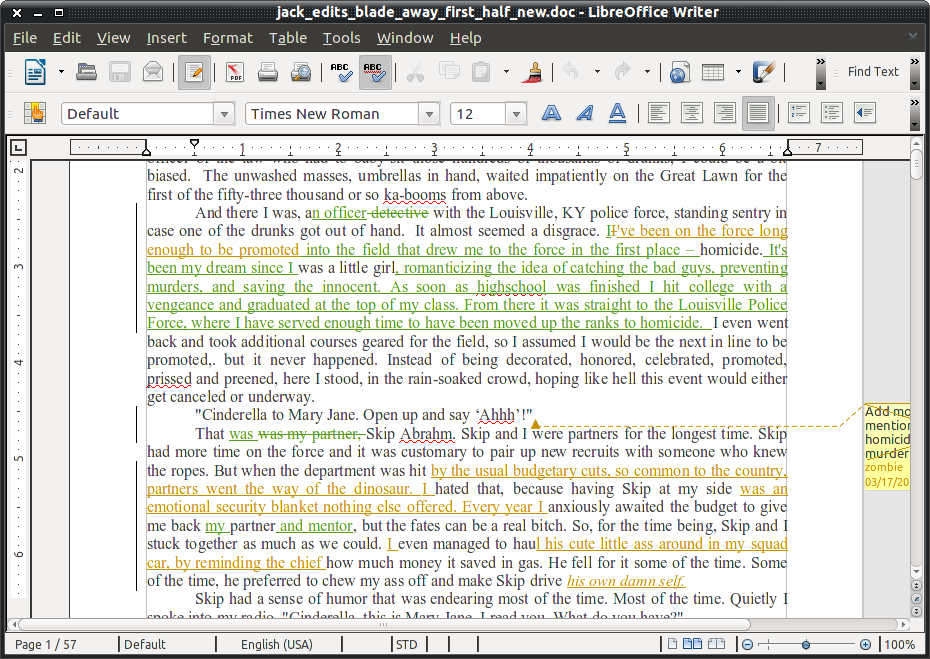

What is 'source control'
========================

Interactive computing as we know it really started in the early '70s with the MULTICS and UNIX systems. These operating
systems invented the concept we know of as a 'file': some named bag of data. They also allowed these files to be changed
while keeping their original name.

Thus the first problem of 'which file am I talking about' arose. As soon as there is more than one `version` of a file
you need to be able to tell someone what that version is.

